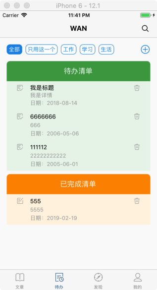
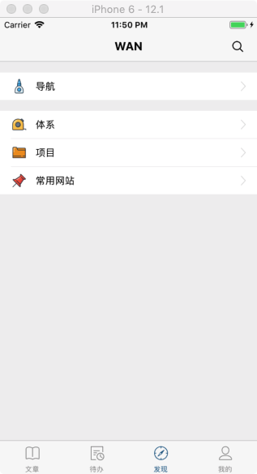
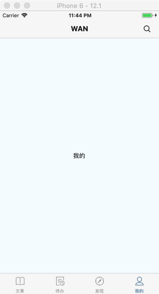

# wan-android-rn

WAN ANDROID 客户端 - React Native 实现版


## 概述

[WAN ANDROID](http://www.wanandroid.com/) ，一个优质的 Android 站点。

WAN ANDROID 站点汇总了 Android 相关的项目、知识体系、公众号文章和工具：

* 在站内你可以及时看到业界最新的博客文章、发现最新的项目
* 同时你也可以利用站点提供的一些工具（比如正则、二维码生成..）来提高开发效率。

本仓库是一个基于 WAN ANDROID 开放 API 开发的 React Native 项目，相关的项目还有：

* wan-android-rn
* [wan-android-kt](https://github.com/zhuanghongji/wan-android-kt)
* [wan-android-flutter](https://github.com/zhuanghongji/wan-android-flutter)


## 代码结构

```
├ src  
   ├ apis                             wanandroid apis
      ├ ...
      └ index.ts
   ├ components                       自定义组件目录
      ├ ...
      └ index.ts 
   ├ m                                RN API 封装目录 
      ├ ...                      
      └ index.ts 
   ├ managers                         管理模块目录
      ├ HttpManager.ts                管理网络请求
      └ StorageManager.ts             管理本地存储   
   ├ pages                            页面目录
      ├ main                          首页目录
         ├ article                    文章目录
             ├ ArticleBannerView.tsx  轮播图组件
             ├ ArticleItemView.tsx    文章列表项组件
             ├ ArticleScreen.tsx      文章页面
         ├ explore                    发现页目录
         ├ mine                       我的页目录
         └ todo                       待办页目录
      ├ navigation                    导航页目录
      ├ project                       项目页目录
      ├ search                        搜索页目录
      ├ sites                         常用网站页目录
      ├ web                           通用网页页面页目录
      └ index.ts            
   ├ res                              资源目录
      ├ images                        图片目录
         ├ files                      图片文件目录
         └ index.ts
      ├ colors.ts                     颜色
      ├ dimensions.ts                 尺寸
      ├ fontSizes.ts                  文字大小
      ├ sheets.ts                     通用样式
      └ index.ts   
   ├ stacks                           页面栈目录
   ├ App.tsx                          根组件
   └ RootStack.tsx                    根页面栈   
├ app.json
└ index.js
```

## 依赖

* @ant-design/react-native
* react-native-swiper
* react-navigation
* typescript
* jest


## 截图

| 主页 | 代办 | 发现 | 我的
| -- | -- | -- | --  
|  |  |  | 

[点击查看更多](./screenshots/)

## 计划

* [ ] 增加启动页，并支持动画
* [x] 支持账号密码登录功能
* [x] 文章列表、文章详情
* [x] 支持增删改查待办事项
* [x] 发现页面：导航、体系、项目、常用网站
* [ ] 发现页面：增加常用公众号入口
* [ ] 我的页面：个人信息、我的收藏、设置

[]() 

* [ ] 接口数据支持缓存，并支持设置缓存策略
* [ ] 使用 Redux 进行状态管理
* [ ] 适配 Android


## License

```
Copyright (C) 2019 zhuanghongji

Licensed under the Apache License, Version 2.0 (the "License");
you may not use this file except in compliance with the License.
You may obtain a copy of the License at

   http://www.apache.org/licenses/LICENSE-2.0

Unless required by applicable law or agreed to in writing, software
distributed under the License is distributed on an "AS IS" BASIS,
WITHOUT WARRANTIES OR CONDITIONS OF ANY KIND, either express or implied.
See the License for the specific language governing permissions and
limitations under the License.
```
